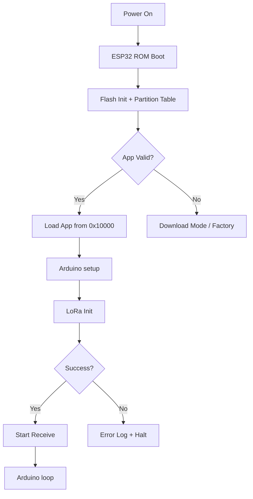

# Embedded Systems Technical Design Document

| Field | Value |
|-------|-------|
| **Project** | LoRa Star Network — IoT Gateway & Sensor/Actuator Nodes |
| **Document Version** | 1.0 |
| **Date** | 2026-07-07 |
| **Author** | Repository Maintainer |
| **Platform** | ESP32 (Xtensa LX6 / LX7) |

---

## 1. Document Control

| Version | Date | Author | Changes |
|---------|------|--------|---------|
| 1.0 | 2026-07-07 | Repo Maintainer | Initial release |

---

## 2. System Overview

A star-topology LoRa network operating at 868 MHz (EU ISM band). Three device types share the same SX1276 radio hardware but run different firmware:

- **Central Gateway**: ESP32-S3 (DevKitC-1) + external RFM95W module, or TTGO LoRa32 v2.1
- **Sensor Node**: TTGO LoRa32 v2.1 with capacitive moisture + DS18B20 + battery monitor
- **Actuator Node**: TTGO LoRa32 v2.1 with TB6612FNG motor driver + latching solenoid valve

All nodes use the same 868 MHz frequency, spreading factor 9, bandwidth 125 kHz, coding rate 5.

---

## 3. Hardware Platform Summary

### 3.1 Central Gateway (ESP32-S3)

| Component | Specification |
|-----------|--------------|
| MCU | ESP32-S3 (Xtensa LX7 dual-core @ 240 MHz) |
| Flash | 16 MB (Quad SPI) |
| RAM | 512 KB SRAM (no PSRAM on this board) |
| Radio | RFM95W (SX1276) @ 868 MHz |
| Radio pins | RST=10, NSS=5, SCK=6, MOSI=7, MISO=8, DIO0=2 |

### 3.2 TTGO LoRa32 v2.1 (All Leaf Nodes)

| Component | Specification |
|-----------|--------------|
| MCU | ESP32 (Xtensa LX6 dual-core @ 240 MHz) |
| Flash | 4 MB (Quad SPI) |
| RAM | 520 KB SRAM |
| Radio | Onboard SX1276 (SPI pins: SCK=5, MISO=19, MOSI=27, CS=18, RST=14, IRQ=26) |
| Display | (Not used in this firmware) |
| Battery | Single-cell Li-ion via TP4056 charger + voltage divider (100k+100k → GPIO35) |

### 3.3 Sensor Node Add-Ons

| Peripheral | Part | Interface | GPIO |
|------------|------|-----------|------|
| Moisture sensor | Capacitive (analog) | ADC | GPIO34 |
| Temperature | DS18B20 | 1-Wire | GPIO4 |
| Battery monitor | Voltage divider (100k+100k) | ADC | GPIO35 |

### 3.4 Actuator Node Add-Ons

| Peripheral | Part | Interface | GPIO |
|------------|------|-----------|------|
| Motor driver | TB6612FNG | Digital I/O | AIN1=GPIO2, AIN2=GPIO4, PWMA=GPIO23, STBY=GPIO17 |
| Latching valve | 2-wire solenoid | H-bridge (30ms pulse) | TB6612 A01/A02 |
| Valve feedback | Limit switch | Digital input (pull-up) | GPIO3 |
| Battery monitor | Voltage divider (100k+100k) | ADC | GPIO35 |

---

## 4. Firmware Architecture

### 4.1 PlatformIO Build Matrix

| Environment | Board | MCU | Radio Library | PSRAM | Flash Size |
|-------------|-------|-----|---------------|-------|------------|
| `central_gateway` | esp32-s3-devkitc-1 | ESP32-S3 | RadioLib | No (config says yes) | 16 MB |
| `central_gateway_ttgo` | ttgo-lora32-v21 | ESP32 | LoRa (sandeepmistry) | No | 4 MB |
| `sensor_node` | ttgo-lora32-v21 | ESP32 | RadioLib | No | 4 MB |
| `actuator_node` | ttgo-lora32-v21 | ESP32 | RadioLib | No | 4 MB |

### 4.2 Boot Sequence (All Nodes)

```
Power-On
  │
  ├─ ESP32 ROM bootloader
  ├─ SPI flash init (DIO mode)
  ├─ Flash encryption check (disabled)
  ├─ Main firmware loaded from 0x10000
  │
  ├─ Arduino setup()
  │   ├─ Serial.begin(115200)        ── 100ms delay
  │   ├─ Pin init (GPIO direction)
  │   ├─ SPI.begin()                  ── shared bus
  │   ├─ radio.begin()               ── LoRa config
  │   │   └─ Frequency, BW, SF, CR, sync word, power, preamble
  │   ├─ radio.startReceive()         ── enters continuous Rx mode
  │   ├─ (Gateway only)
  │   │   ├─ WiFi.begin()
  │   │   ├─ MQTT broker start
  │   │   ├─ WebDashboard.begin()
  │   │   ├─ NodeManager.begin()      ── NVS load
  │   │   └─ WeatherStation.begin()   ── ISR attach
  │   └─ (Leaf nodes)
  │       ├─ DS18B20.begin() (sensor)
  │       └─ sendTelemetry / sendHeartbeat (first packet)
  │
  └─ Arduino loop()
      ├─ LoRa Rx path (polling)
      ├─ Gateway MQTT + dashboard loop
      ├─ Sensor telemetry timer (5s)
      ├─ Actuator heartbeat timer (30s)
      └─ delay(10-100ms)
```

### 4.3 Task Model (Super Loop — No RTOS)

All nodes run a single `loop()` function. There is no FreeRTOS task creation — the Arduino framework runs `loop()` as a single task.

| Node | Loop Iteration Time | Blocking Calls | Maximum Latency |
|------|---------------------|----------------|-----------------|
| Gateway | ~15ms (delay 5 + process) | LoRa Tx (~150ms), OTA upload | < 1s |
| Sensor | ~100ms (delay 100 + process) | LoRa Tx (~150ms every 5s) | < 250ms |
| Actuator | ~10ms (delay 10 + process) | LoRa Tx (~150ms) | < 200ms |

---

## 5. Functional Requirements

| ID | Requirement | Verification |
|----|-------------|-------------|
| EFR-01 | SX1276 RFM95W initializes with correct SPI pins on ESP32-S3 | `radio.begin()` returns 0 |
| EFR-02 | SX1276 on TTGO initializes via onboard SPI | `radio.begin()` returns 0 |
| EFR-03 | LoRa Rx sensitivity ≥ -130 dBm (SF9, BW125) | Range test |
| EFR-04 | LoRa Tx power configurable to 10-20 dBm | `setOutputPower()` |
| EFR-05 | CRC check enabled on all packets | RadioLib default |
| EFR-06 | Sensor ADC oversamples 16-32 reads per measurement | Code inspection |
| EFR-07 | Valve actuated via 30ms H-bridge pulse | Oscilloscope / audible click |
| EFR-08 | Battery voltage measured via 2:1 divider | Multimeter comparison |
| EFR-09 | DS18B20 temperature read with error detection | Serial output |
| EFR-10 | NVS node provisioning survives power cycle | Reboot test |

---

## 6. Real-Time Requirements

| Requirement | Constraint | Criticality |
|-------------|------------|-------------|
| Downlink command → valve actuation | < 2 seconds from dashboard click | Medium |
| Sensor telemetry interval | 5000 ms ± 100 ms | Low |
| Heartbeat interval | 30000 ms ± 500 ms | Low |
| LoRa Tx timeout | 5000 ms (RadioLib default) | Medium |
| ADC settling time | 50 µs between samples | Low |

**Note**: There are no hard real-time deadlines. The system is soft real-time with polling loops.

---

## 7. Safety / Security Requirements

| ID | Requirement | Implementation |
|----|-------------|----------------|
| SSR-01 | All LoRa packets MUST be encrypted with AES-128-GCM | `CryptoEngine::encrypt()` |
| SSR-02 | All LoRa packets MUST have authentication tag validated | `CryptoEngine::decrypt()` returns ERR_AUTH on mismatch |
| SSR-03 | Replay attacks MUST be prevented | Sequence counter check (`seq > lastSeq`) |
| SSR-04 | Node PSK MUST NOT be transmitted over LoRa | PSK provisioning is dashboard-only (WiFi) |
| SSR-05 | Valve MUST NOT be actuated without valid decrypt | `processPacket()` gates on `CryptoResult::OK` |
| SSR-06 | Motor driver standby MUST be LOW when idle | `digitalWrite(STBY, LOW)` after pulse |
| SSR-07 | ADC pins must not exceed 3.3V | Voltage divider provides 2:1 ratio |

---

## 8. Power / Memory Budgets

### 8.1 Static Memory (RAM) — Gateway

| Component | Size | Notes |
|-----------|------|-------|
| `.bss` + `.data` (app) | ~23 KB | From build output |
| WiFi LWIP buffers | ~40 KB | Dynamic |
| AsyncWebServer buffers | ~20 KB | Dynamic |
| MQTT broker buffers | ~10 KB | Dynamic |
| NodeManager array (16 × 60 B) | 960 B | `.bss` |
| SPI DMA buffer | ~2 KB | HAL-allocated |
| SX1276 register cache | ~128 B | RadioLib |
| **Total heap (available)** | **~278 KB** | At boot |
| **Peak usage** | **~60-80 KB** | After WiFi + dashboard |

### 8.2 Static Memory (RAM) — Leaf Nodes

| Component | Size | Notes |
|-----------|------|-------|
| `.bss` + `.data` (app) | ~23 KB | From build output |
| RadioLib state | ~1 KB | SX1276 instance |
| CryptoEngine context | ~512 B | mbedtls GCM struct |
| Serial TX buffer | ~256 B | Arduino |
| **Total RAM used** | **~25-30 KB** | Out of 520 KB |

### 8.3 Flash Usage

| Environment | Flash Used | Available |
|-------------|------------|-----------|
| `central_gateway` | ~946 KB | 16 MB |
| `sensor_node` | [TO_FILL] | 4 MB |
| `actuator_node` | ~314 KB | 4 MB |

### 8.4 Power Estimation (Leaf Nodes)

| State | Current | Duration | Energy per Cycle |
|-------|---------|----------|-----------------|
| Active (CPU running) | ~80 mA | Continuous | — |
| LoRa Tx (20 dBm) | ~120 mA | ~150 ms | 5 mAs |
| LoRa Rx (listen) | ~12 mA | Continuous (RxContinuous mode) | — |
| Valve pulse | ~250 mA (motor + MCU) | 30 ms | 2.1 mAs |
| **Average (sensor, 5s cycle)** | **~82 mA** | — | — |
| **Average (actuator, idle)** | **~80 mA** | — | — |

**Note**: Nodes are assumed mains-powered (USB). No deep sleep is used. The current consumption is acceptable for always-on operation.

---

## 9. HW-SW Interface

### 9.1 Complete Pin Map

#### Gateway — ESP32-S3 (central_gateway env)

| Function | GPIO | Direction | Pull | Notes |
|----------|------|-----------|------|-------|
| RFM95W RST | 10 | Output | — | Active LOW reset |
| RFM95W NSS | 5 | Output (SPI CS) | — | Chip select |
| RFM95W SCK | 6 | Output (SPI CLK) | — | SPI clock (not default 18) |
| RFM95W MOSI | 7 | Output (SPI MOSI) | — | SPI MOSI |
| RFM95W MISO | 8 | Input (SPI MISO) | — | SPI MISO |
| RFM95W DIO0 | 2 | Input | — | IRQ (conflicts with PSRAM D4) |
| Rain gauge | [TO_FILL] | Input (ISR RISING) | PULLUP | WeatherStation |
| Wind vane | ADC | Input | — | WeatherStation |
| Anemometer | [TO_FILL] | Input (ISR RISING) | PULLUP | WeatherStation |

#### Gateway / Sensor / Actuator — TTGO LoRa32 v2.1

| Function | GPIO | Direction | Pull | Notes |
|----------|------|-----------|------|-------|
| SX1276 NSS | 18 | Output (SPI CS) | — | Default TTGO |
| SX1276 SCK | 5 | Output (SPI CLK) | — | Default TTGO |
| SX1276 MOSI | 27 | Output (SPI MOSI) | — | Default TTGO |
| SX1276 MISO | 19 | Input (SPI MISO) | — | Default TTGO |
| SX1276 RST | 14 | Output | — | Not GPIO23 (default) to avoid strapping |
| SX1276 DIO0 | 26 | Input | — | IRQ |

#### Sensor Node Only

| Function | GPIO | Direction | Pull | Notes |
|----------|------|-----------|------|-------|
| Moisture sensor | 34 | ADC1_CH6 | — | 0-3.3V analog input |
| DS18B20 | 4 | Open-drain | 4.7kΩ | 1-Wire bus |
| Battery ADC | 35 | ADC1_CH7 | — | Via 100k+100k divider |

#### Actuator Node Only

| Function | GPIO | Direction | Pull | Notes |
|----------|------|-----------|------|-------|
| TB6612 AIN1 | 2 | Output | — | H-bridge input 1 |
| TB6612 AIN2 | 4 | Output | — | H-bridge input 2 |
| TB6612 PWMA | 23 | Output (PWM) | — | Set HIGH for full speed |
| TB6612 STBY | 17 | Output | — | Active HIGH enable |
| Valve feedback | 3 | Input | PULLUP | Limit switch |
| Battery ADC | 35 | ADC1_CH7 | — | Via 100k+100k divider |

### 9.2 SPI Bus Configuration

| Parameter | Gateway (S3) | TTGO (all) |
|-----------|-------------|-------------|
| Frequency | ~1 MHz (RadioLib default) | ~1 MHz (RadioLib default) |
| Mode | 0 (CPOL=0, CPHA=0) | 0 |
| Bit order | MSB first | MSB first |
| DMA channel | None (polling SPI) | None |

### 9.3 Interrupts

| ISR | GPIO | Trigger | Service | Critical Section |
|-----|------|---------|---------|------------------|
| Rain tick | [TO_FILL] | RISING | `_rainCnt++` | None (volatile uint32) |
| Wind tick | [TO_FILL] | RISING | `_windCnt++` | None (volatile uint32) |
| LoRa DIO0 | 2 (S3) / 26 (TTGO) | RISING | Not used (polling) | N/A |

**Known Issue**: On ESP32-S3, GPIO2 (DIO0) is also used as OPI PSRAM data line D4. Since the board has no PSRAM, this is safe but the signal integrity may be compromised. The `manualTransmit()` workaround polls IRQ flags via SPI instead of relying on DIO0 interrupts.

### 9.4 ADC Configuration

| Channel | GPIO | Attenuation | Resolution | Oversamples |
|---------|------|-------------|------------|-------------|
| ADC1_CH6 | 34 | 11 dB (0-3.3V) | 12-bit (0-4095) | 16 |
| ADC1_CH7 | 35 | 11 dB (0-3.3V) | 12-bit (0-4095) | 32 |

The attenuation 11 dB provides the full 0-3.3V range. Battery voltage is calculated as:
```
V_bat = (adc_value / 4095.0) * 3.3 * 2.0
```
Where the `* 2.0` factor accounts for the 100k+100k voltage divider.

---

## 10. Communication Protocol Design

### 10.1 LoRa Physical Layer Parameters

| Parameter | Value | Rationale |
|-----------|-------|-----------|
| Frequency | 868.0 MHz | EU ISM band (863-870 MHz) |
| Bandwidth | 125 kHz | Balance of range and throughput |
| Spreading Factor | 9 | ~2.5 km urban range typical |
| Coding Rate | 5 (4/5) | Moderate error correction |
| Sync Word | 0x12 (RadioLib) / default (LoRa lib) | Network isolation |
| Tx Power | 10 dBm (default) | Legal limit EU: 14 dBm (25 mW) ERP |
| Preamble | 10 symbols (leaf) / 12 (gateway) | Standard |
| CRC | Enabled | Packet integrity |
| Implicit Header | Off (explicit header) | Flexible payload size |

### 10.2 Over-the-Air Throughput

| SF | BW | CR | Raw Bitrate | Effective* |
|----|-----|-----|--------------|------------|
| 9 | 125 kHz | 4/5 | ~878 bps | ~350 bps |

*Effective after preamble, header, CRC overhead.

With 46-byte max packet and ~350 bps effective:
- **Time on air per packet**: ~1.05 s
- **Max packets per hour** (1% duty cycle): ~34

### 10.3 Duty Cycle Compliance

EU regulation EN 300.220 mandates 1% duty cycle in the 868 MHz band for non-adaptive devices.

| Node | Packet Type | Interval | Duty Cycle |
|------|-------------|----------|------------|
| Sensor | Telemetry (46 B) | 5 s | 21% **--- OVER LIMIT** |
| Actuator | Heartbeat (45 B) | 30 s | 3.5% **--- OVER LIMIT** |
| Actuator | ACK (45 B) | Per command | ~0.1% (infrequent) |
| Gateway | Command (46 B) | Per toggle | ~0.1% (infrequent) |

**⚠ Non-compliance**: The sensor node's 5-second transmission interval exceeds the 1% duty cycle limit. A 5-second interval with ~1s time-on-air gives ~20% duty cycle. For regulatory compliance, the interval should be ≥ 100 seconds, or Tx power must be reduced.

### 10.4 Packet Structure

```
Byte 0-1:   Node ID (big-endian)
Byte 2-13:  IV / Nonce (12 bytes)
Byte 14:    Packet Type
Byte 15-25: Ciphertext (variable)
Byte last-4: MIC (4 bytes truncated GCM tag)
```

### 10.5 Crypto Parameters

| Parameter | Value |
|-----------|-------|
| Algorithm | AES-128-GCM |
| Key size | 16 bytes (128 bits) |
| Nonce size | 12 bytes (96 bits) |
| Tag size | 4 bytes (truncated from 16) |
| AAD | 7 bytes (NodeID + Type + Seq) |
| Implementation | mbedtls (ESP-IDF built-in) |

---

## 11. State Machines / Task Model

### 11.1 Gateway Main Loop

```
loop()
├── processLoRa()
│   ├── Check RxDone (IRQ flag poll)
│   ├── Read FIFO
│   ├── Decrypt with node PSK
│   │   ├── Success → dispatch to onDecryptedPkt()
│   │   └── Fail → log, return
│   └── Re-arm Rx (startReceive)
├── mqttBroker.loop()
├── dashboard.loop()
├── Weather telemetry (every 30s)
└── delay(5ms)
```

### 11.2 Sensor Main Loop

```
loop()
├── Check 5s timer
│   ├── Read moisture ADC (16x oversample)
│   ├── Read DS18B20 temperature
│   ├── Read battery ADC (32x oversample)
│   ├── Assemble telemetry struct
│   ├── AES-128-GCM encrypt
│   ├── radio.transmit()
│   └── Request next DS18B20 conversion
└── delay(100ms)
```

### 11.3 Actuator Main Loop

```
loop()
├── Check RxDone (IRQ flag poll) + packet length
│   ├── processPacket()
│   │   ├── readData (FIFO)
│   │   ├── AES-128-GCM decrypt
│   │   ├── Replay check
│   │   ├── Execute valve command
│   │   └── sendAck() (encrypted)
│   └── startReceive()
├── Check 30s heartbeat timer
│   ├── sendHeartbeat() (encrypted)
│   └── startReceive()
└── delay(10ms)
```

---

## 12. Boot / Update / Rollback Strategy

### 12.1 Boot



### 12.2 OTA Update (Gateway Only)

1. User uploads firmware via dashboard `POST /api/ota/upload`
2. ESP Async WebServer receives the binary in chunks
3. `Update.write()` writes to the OTA partition (app0 or app1)
4. On completion, `Update.end()` reboots into new firmware
5. Rollback: re-upload previous firmware via OTA or USB

### 12.3 Leaf Node Updates

Sensor and actuator nodes do NOT support OTA. Firmware is updated via USB/serial:
```bash
pio run -e sensor_node -t upload --upload-port COM_PORT
```

**Future possibility**: Add LoRa-based OTA with chunked firmware transfer and CRC verification. This would require a bootloader modification and additional flash partition.

---

## 13. Fault Handling / Diagnostics

### 13.1 Hardware Faults

| Fault | Symptom | Detection | Recovery |
|-------|---------|-----------|----------|
| Radio init fail | `radio.begin()` returns non-zero | Serial log | Halt (no fallback) |
| Radio Tx hang | Tx never completes | `manualTransmit()` timeout after 5s | Re-init radio |
| Radio Rx dead | No packets received | Heartbeat from actuator times out (30s) | `radio.startReceive()` |
| WiFi disconnect | `WiFi.status()` != WL_CONNECTED | ESP-IDF event callback | Auto-reconnect |
| DS18B20 missing | Returns `DEVICE_DISCONNECTED_C` | `err |= 0x02` in telemetry | Use 0°C fallback |
| Moisture sensor fault | ADC < 10 or ADC > 4000 | `err |= 0x01` in telemetry | Report invalid |
| NVS corruption | `nvs_open()` fails | Log | `nvs_flash_erase()` (manual) |

### 13.2 Software Faults

| Fault | Detection | Recovery |
|-------|-----------|----------|
| Heap exhaustion | `malloc` returns NULL | Log free heap, restart if < 5% |
| GCM decrypt error | `CryptoResult != OK` | Drop packet, log node_id + seq |
| Stack overflow | Watchdog timer (if enabled) | — (not currently configured) |
| Infinite loop in Rx path | RxDone gate with getIRQFlags | Fixed in v2 — see RxDone check |

### 13.3 Diagnostics Interface

All diagnostics output over serial at 115200 baud. Log format:
```
[<NODE_PREFIX>] <event>: <details>
```

Critical values logged:
- Heap free at boot and periodically
- LoRa begin status and chip version
- Each packet: source, RSSI, pkt_type, seq, decrypt result
- Each command: seq, command byte, value
- WiFi connection status and IP

---

## 14. Verification & Validation Plan

### 14.1 Hardware Bring-Up Tests

| Test | Procedure | Pass Criteria |
|------|-----------|---------------|
| SPI bus | Verify MISO/MOSI/SCK with oscilloscope | Clean 1 MHz square wave |
| Radio loopback | Transmit then receive on same board | `getPacketLength() > 0` |
| Range test | Two nodes at max distance | RSSI > -120 dBm at 100m |
| Battery ADC | Measure GPIO35 voltage with multimeter | Reading matches within ±5% |
| Valve trigger | Pulse GPIO2/4/23/17 sequence | Audible click, valve opens/closes |
| DS18B20 | Read temperature vs reference | Within ±1°C |
| Moisture sensor | Dry sensor → wet sensor | ADC drops from ~2500 to ~400 |

### 14.2 Firmware Validation Tests

| Test | Command | Pass Criteria |
|------|---------|---------------|
| Build all | `pio run` | All 6 envs succeed |
| Gateway boot | Serial monitor | `[GW] Dashboard: http://...` printed |
| Dashboard serve | HTTP GET on gateway IP | Returns index.html (200 OK) |
| REST health | GET /api/health | Returns JSON with uptime, heap |
| Node provision | Dashboard form | NVS persists after reboot |
| Sensor telemetry | Serial on sensor + gateway | `[SN]` seq increments, `[GW]` receives and decrypts |
| Actuator command | Dashboard toggle | Valve opens/closes, ACK received |
| Replay protection | Send duplicate seq | Gateway logs "Replay", drops packet |

---

## 15. Manufacturing / Provisioning

### 15.1 First-Time Setup

1. **Flash firmware**: USB upload via PlatformIO (all nodes)
2. **Upload filesystem**: Gateway only — `uploadfs` for dashboard SPA
3. **Power gateway**: Connect to WiFi (SSID in `main.cpp`)
4. **Find IP**: From serial output
5. **Open dashboard**: `http://<ip>`
6. **Provision node**: Fill form (ID, PSK hex, type, alias) → stored in NVS
7. **Set sensor PSK**: Hardcoded in `src/sensor/main.cpp`
8. **Set actuator PSK**: Hardcoded in `src/actuator/main.cpp`
9. **Verify**: Sensor telemetry appears on dashboard within 5 seconds

### 15.2 Provisioning Security

PSK is entered as 32 hex characters in the dashboard WebSocket action `add_node`. It is stored in NVS as a 16-byte binary blob. The PSK is never transmitted over LoRa.

**⚠ Production hardening**: Currently, sensor and actuator firmware have PSKs hardcoded at compile time. For production:
- Add a provisioning mode (button + serial prompt) to set PSK at first boot
- Or generate PSK from device unique ID (MAC) with a master secret

---

## 16. Compliance / Standards

| Standard | Applicability | Status |
|----------|--------------|--------|
| EN 300.220 (EU SRD) | 868 MHz LoRa radio | **Duty cycle non-compliant** (sensor 21% vs 1% limit) |
| RED (2014/53/EU) | Radio equipment | **Not certified** — prototype only |
| FCC Part 15 (US) | 915 MHz variant (if ported) | N/A (868 MHz EU band) |
| GDPR | Personal data | No personal data transmitted |

---

## 17. Risks / Mitigations

| Risk | Probability | Impact | Mitigation |
|------|-------------|--------|------------|
| EU duty cycle excess | Certain (sensor: 21%) | Regulatory | Increase interval to ≥100s OR reduce power OR add listen-before-talk |
| DIO0=GPIO2 conflict on S3 | Certain (current hw) | Tx reliability | `manualTransmit()` polling workaround deployed |
| No PSRAM on S3 dev board | High | Boot crash | Remove `BOARD_HAS_PSRAM`, change memory type to `qio` |
| SPI pin mismatch (S3 vs TTGO) | High | No LoRa on wrong env | `#ifdef` pin definitions per env |
| No DFS on leaf nodes | Medium | Flash wear (5s writes) | Acceptable for development |
| mbedtls tag length bug | Fixed | Crypto failure | `GCM_TAG_TRUNCATED = 4` fix applied |

---

## 18. Open Questions

1. **Duty cycle compliance**: Should the sensor interval be increased to 100s to meet EN 300.220? This would significantly reduce real-time monitoring resolution.
2. **RadioLib on TTGO**: Has RadioLib's SX1276 driver been tested on TTGO LoRa32 v2.1? The `LoraRadio` wrapper exists because of past IRQ flag issues.
3. **Booster for valve**: The TB6612FNG requires 4.5-6V on VMOT. A single Li-ion (3.7-4.2V) may not be sufficient. Is a boost converter present?
4. **WiFi reconnection strategy**: The gateway currently prints dots while waiting for WiFi. Should it implement a watchdog timeout and retry?
5. **RTC/Deep sleep**: If battery-powered operation is needed later, deep sleep with RTC timer would require significant architectural changes.

---

## 19. Milestones / Bring-up Plan

| Phase | Milestone | Duration | Deliverable |
|-------|-----------|----------|-------------|
| 1 | Hardware bring-up | 1 day | SPI verified, radio loopback passes |
| 2 | Sensor firmware | 2 days | Moisture + temp + battery telemetry sent every 5s |
| 3 | Gateway firmware | 3 days | WiFi + LoRa Rx + MQTT + dashboard working |
| 4 | Crypto integration | 2 days | AES-128-GCM encrypt/decrypt end-to-end |
| 5 | Actuator firmware | 2 days | Valve control + heartbeat + ACK |
| 6 | Integration test | 2 days | Full round-trip: toggle → valve → ACK |
| 7 | Range test | 1 day | Max distance with acceptable RSSI |
| 8 | Regulatory check | 1 day | Duty cycle calculation and remediation |

---

## 20. Definition of Done

- [ ] All 3 node types compile and run on target hardware
- [ ] Sensor telemetry is decrypted and displayed on dashboard
- [ ] Actuator responds to downlink commands within 2 seconds
- [ ] Encrypted packets are authenticated (invalid MIC rejected)
- [ ] Replay protection drops duplicate sequence numbers
- [ ] NVS provisioning survives power cycle
- [ ] Dashboard serves correctly from LittleFS
- [ ] OTA update works on gateway
- [ ] All GPIOs verified with multimeter / oscilloscope
- [ ] Range test at 100m shows RSSI > -120 dBm

---

## 21. Appendix

### A. SX1276 Register Map (Critical Registers)

| Reg | Address | Purpose | Config Value |
|-----|---------|---------|--------------|
| RegOpMode | 0x01 | Operating mode | 0x80 (LoRa + Sleep) → 0x85 (RxContinuous) |
| RegModemConfig1 | 0x1D | BW + CR | 0x79 (BW125 + CR4/5) |
| RegModemConfig2 | 0x1E | SF + CRC | 0xC4 (SF9 + CRC on) |
| RegSymbTimeoutLsb | 0x1F | Symbol timeout | 0x08 (100 symbols) |
| RegPreambleMsb | 0x20 | Preamble length | 0x00 (10 symbols) |
| RegPreambleLsb | 0x21 | Preamble length | 0x0A (10 symbols) |
| RegPayloadLength | 0x22 | Fixed payload length | 0x00 (variable) |
| RegIrqFlags | 0x12 | IRQ flags | Read to check RxDone |
| RegRxNbBytes | 0x13 | Received bytes | Read-only |

### B. Tool Versions

| Tool | Version |
|------|---------|
| PlatformIO Core | 6.x |
| ESP32 Arduino core | 3.2.0 |
| ESP-IDF | 5.x (bundled) |
| mbedtls | 3.x (ESP-IDF) |
| RadioLib | 6.6.0 |
| OpenOCD | (ESP32 toolchain) |
| esptool.py | 4.11.0 |

### C. Glossary

| Term | Definition |
|------|------------|
| AAD | Additional Authenticated Data — data bound to ciphertext but not encrypted |
| CAD | Channel Activity Detection — LoRa feature to detect preamble |
| DIO0 | Digital I/O pin 0 on SX1276 — used for RxDone/TxDone interrupts |
| GCM | Galois/Counter Mode — authenticated encryption mode |
| MIC | Message Integrity Code — authentication tag |
| NVS | Non-Volatile Storage (ESP-IDF) — key-value flash storage |
| OPI | Octal Peripheral Interface — 8-line PSRAM interface |
| PSK | Pre-Shared Key — 16-byte encryption key per node |
| SF | Spreading Factor — LoRa modulation parameter (7-12) |
| SX1276 | Semtech LoRa transceiver (same as RFM95W) |
